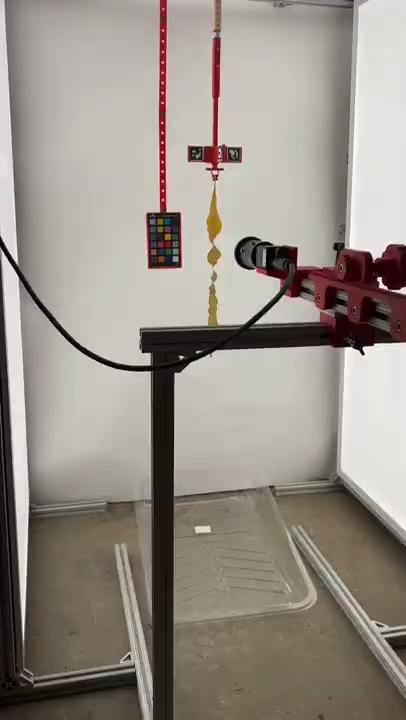
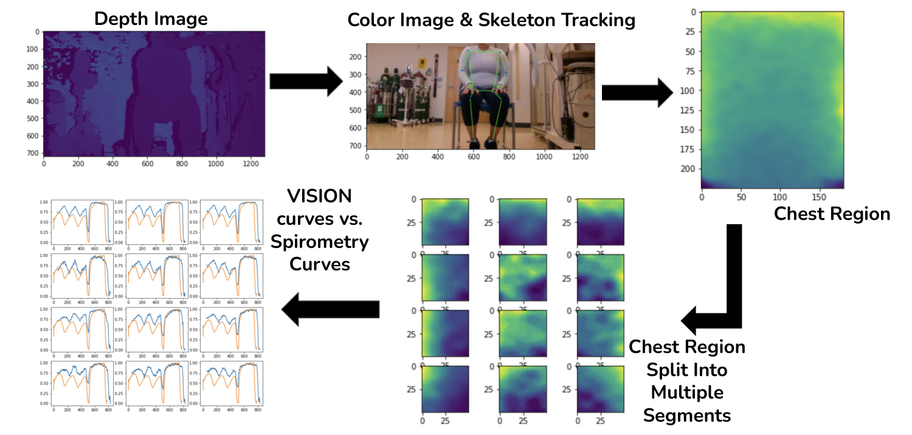
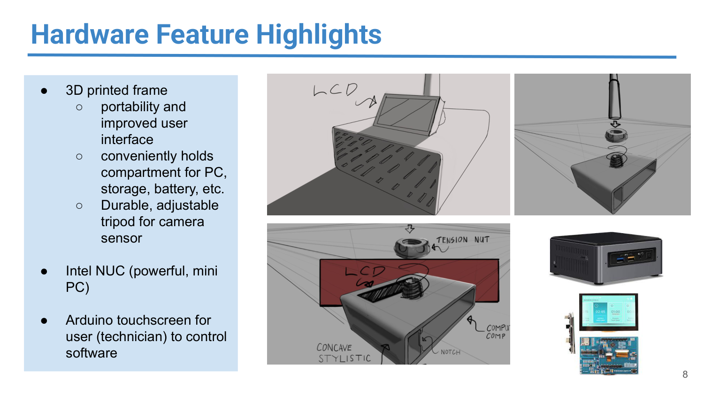
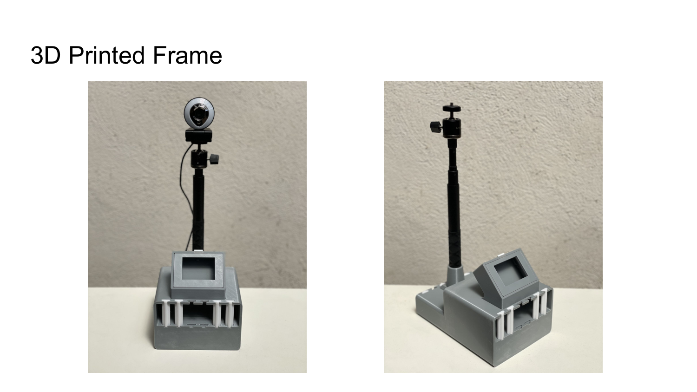

<h1 align="center">Hi, I'm Franklin 👋</h1>

  

  <b>CV / ML engineer based in NYC, building 0 → 1 systems across <i>healthcare</i>, <i>climate</i>, and <i>robotics</i>.</b>

  <a href="https://www.linkedin.com/in/franklinheng/">LinkedIn</a> ·
  <a href="https://scholar.google.com/citations?user=toxljCEAAAAJ">Google Scholar</a> ·
  <a href="mailto:heng.franklin@gmail.com">heng.franklin@gmail.com</a>

---

## Computer Vision / ML

### Running Tide — computer vision for ocean carbon removal
> *Built the CV stack that verified biomaterial sinking, shellfish growth, and macroalgae biomass at sea.*

<table>
<tr>
<td width="33%" valign="top">

**🌲 Offshore sink-rate tracking**

Verifying ocean-carbon removal requires an empirical sinking curve for each batch of biomaterial deployed at sea. The pipeline pulls imagery from custom ocean-buoy cameras, filters noisy frames (fog, occlusion, bubbles) through an **AutoML CNN**, then segments wood chips with **Mask-RCNN**, chosen for per-pixel accuracy on our ~2,000-image dataset. Pixel-area over time is fit to an **exponential-decay curve** that feeds the carbon-verification dashboard.

- **Stack:** Mask-RCNN · AutoML CNN · Cloud Composer / Airflow · Docker
- **Eval:** IoU + mAP on segmentation; curves reviewed by the oceanography team

</td>
<td width="33%" valign="top">

**🌿 Kelp 3D phenotyping**

Generating 3D reconstructions of kelp from multi-view imagery lets researchers compute volumetric and morphological measurements. A **Structure-from-Motion** pipeline was the right fit because our controlled imaging rig gave the high image overlap and repeatability SfM needs.

**Pipeline:**
- **COLMAP** — sparse point cloud from multi-view RGB
- **Metashape** — dense cloud + photorealistic texture
- **Open3D** — outlier removal, voxelization, convex-hull volume

**Eval:** reconstruction quality gauged by bundle-adjustment reprojection error.

**Hardware setup**

- High-resolution industrial RGB camera on a **linear rail** for flexible positioning
- **Color-calibration card** in every capture for cross-session colorimetry
- Controlled lighting to minimize specular highlights on wet blades
- **Tunable sample rotation speed** to adjust SfM overlap
- Automatic image upload from rig → cloud → reconstruction job

📄 [*NAPPN 2022*](https://www.authorea.com/users/510851/articles/588338-nappn-annual-conference-abstract-computer-vision-based-phenotyping-approaches-in-the-brown-macroalgae-saccharina-latissima)

</td>
<td width="33%" valign="top">

**🦪 Robotic shellfish counter**

Each image from our robotic harvesting platform held ~1,000 shellfish, some as small as 2×2 px. I fine-tuned **Faster-RCNN** because its two-stage design let us tune anchor-box scales specifically for that small-object regime. A custom post-processing pass refines the smallest detections before they hit the counter.

- **Performance:** >90% accuracy at 0.125 s/image
- **Eval:** classification cross-entropy, bbox L1/L2, absolute counting error vs. human counts

</td>
</tr>
</table>

---

### UCSF — clinical computer vision (Fahy / Abbasi / Sohn Labs)

<table>
<tr>
<td width="33%" valign="top">

**🫁 Mucus plug segmentation**

Mucus plugs in lung airways are a key driver of airflow limitation in asthma, but counting and measuring them from CT had been a manual radiology task. I built an automated pipeline that detects, segments, and measures plugs in 3D, then maps each one back to its airway generation.

**Pipeline:**
- Intensity-threshold lung segmentation + region growing to isolate airways
- **GK fuzzy clustering** for plug isolation, chosen over hard thresholding because it handles partial-volume effects at tissue boundaries
- **Mask-RCNN** for per-plug instance segmentation so each plug can be counted individually
- **Marching cubes** → 3D mesh; **PCA cylinder fitting** for length and width measurement

Plugs were classified **stubby (≤12 mm) vs. stringy (>12 mm)** and used to derive a novel airway-resistance score that correlated with FEV₁ decline across **580+ patients**. Segmentation evaluated on IoU + mAP; outputs reviewed by the radiology team.

📄 [*JCI Insight* (2023)](https://insight.jci.org/articles/view/174124)

</td>
<td width="33%" valign="top">

**🧠 Brain age prediction**

The gap between a patient's predicted "brain age" and their actual age can be a signal of underlying systemic disease. I trained a custom **3D CNN** on brain CT scans to predict brain age, then analyzed the prediction gap against a panel of systemic conditions.

- **Model:** 3D CNN with volumetric regional segmentation, 8 regions per scan
- **Analysis:** GLM correlating predicted brain-age gap against the systemic disease panel

</td>
<td width="33%" valign="top">

**⚡ EEG engagement decoding**

Decoding attentional engagement from raw EEG needed a representation that stayed interpretable across subjects. **NMF** was chosen because its non-negative parts-based decomposition exposes coefficient patterns that can be mapped directly onto the scalp.

- **Pre-processing:** Morlet wavelet spectrograms from 64-channel EEG
- **Decomposition:** NMF across trials
- **Findings:** coefficient analysis reveals distinct scalp-topography patterns between engaged and non-engaged states

</td>
</tr>
</table>

---

### Breathily — contactless lung function for ALS patients
> *🥈 2nd place, UC Launch · Funded by UCSF Catalyst · NSF I-Corps · 📜 [US Patent](https://patents.google.com/patent/US20240090795A1/en)*

   
  ▶️ <a href="https://www.youtube.com/watch?v=MaBf3D1GvQA">Watch the demo</a>

   
  Clinical-study data-collection pipeline: depth + color → skeleton tracking → chest-region segmentation → segment-wise depth signals → Breathily vs. spirometer curves

Patients with ALS and other neuromuscular diseases often can't form a seal around a traditional spirometer mouthpiece, which makes standard pulmonary function testing impossible for them. We co-founded Breathily to make spirometry mouthpiece-free: **Intel RealSense depth cameras** capture chest-wall movement, and computer vision converts that movement into the full PFT panel (FVC, FEV1, PEF).

**How it works:**
- **Cubemos + MediaPipe** for real-time pose estimation, used to locate the chest-wall ROI on each frame
- **RealSense SDK** for depth-to-metric conversion, native to the sensor so no external calibration is needed
- A scaling factor (reference spirometer volume ÷ raw chest displacement) converts the 1-D breathing waveform into L and L/s

**Stack:** Intel RealSense · Cubemos · OpenCV · SciPy · Pixel2Mesh · CNN+LSTM (Keras)

**Eval:** correlation coefficient, RMSE, and MAE against a paired spirometer in an **IRB-approved patient study at UCSF Pulmonary Function Lab**.

**Hardware Setup**

<table>
<tr>
<td width="50%" valign="top">

Design — hand-drawn layout, Intel NUC and Arduino components

</td>
<td width="50%" valign="top">

Build — final 3D-printed enclosure with camera post and screen recess

</td>
</tr>
</table>

The final system is a custom 3D-printed enclosure housing the **Intel RealSense** camera on an adjustable post, an **Intel NUC** mini-PC for vision processing, and an **Arduino-driven touchscreen** for technician control, with compartments for battery and storage. The rig was deployed at the UCSF Pulmonary Function Lab for the clinical study, seated alongside the reference spirometer.

📂 [Repo](https://github.com/hengfranklin/Breathily)

---

### UC Berkeley — agricultural robotics CV

  

Estimated **sorghum stem width** from video captured by a moving robotic platform. **Faster-RCNN** locates stems in each frame, then an edge-based refinement stage recovers the stem boundary before depth-based metric conversion.

**Pipeline:**
- **Faster-RCNN** for stem detection
- **Wiener filter** for pre-edge noise reduction
- **Canny edges + morphological operations** to isolate stem boundaries
- **RANSAC** for a clean boundary fit
- Metric width computed from the paired **depth image**

📄 [*Sahiner, Heng, Balamurugan, Zakhor* — **"In Situ Width Estimation of Biofuel Plant Stems"**, Electronic Imaging 2019](https://library.imaging.org/ei/articles/31/13/art00009)

---

## Full Stack AI Engineering

<table>
<tr>
<td width="33%" valign="top">

#### Make The Dot

Designers needed photorealistic garment renders from a hand sketch, a color, and a fabric spec, without retraining a model each time a new material was added. I owned the end-to-end pipeline: base model, control signals, LoRA training, and GPU serving.

**Model stack:**
- **SDXL Juggernaut v10** as the base, chosen for its curated photorealistic training data
- **ControlNet-Union** for structural adherence to the sketch
- **Custom LoRAs** chosen over IP-adapters and full fine-tuning because they support weighted blending at inference (e.g. *faded = light @0.9 + bleach @0.3*) without retraining

**Serving:** NVIDIA Triton + TensorRT on H100, with multi-LoRA blending and zero-downtime hot-swap via Hyperdisk ML on GKE.

**Eval:** weighted-MSE noise-prediction loss during training; an in-house A/B tool where the design team rated experimental vs. production outputs (worse / same / better) for promotion decisions.

📂 [Repo](https://github.com/hengfranklin/mtd-portfolio)

</td>
<td width="33%" valign="top">

#### FOIA Fluent

Civic AI that finds public records and drafts legally optimized FOIA / FOIL / CPRA / PIA requests. **Anti-hallucination drafting** — Claude writes only from verified statute text, eCFR regulations, and MuckRock outcomes.

📂 [Repo](https://github.com/dssg-nyc/FOIA-Fluent) · 🔗 [Website](https://www.foiafluent.com)

</td>
<td width="33%" valign="top">

#### GridTech
🥈 *Cross-Columbia GridTech Hackathon 2026*

Consolidates fragmented NY energy efficiency programs (Smartcharge NY, SCERP, IRA 30C), surfaces eligibility, and gives utilities a dashboard targeting underutilized programs and grid congestion.

📂 [Repo](https://github.com/hengfranklin/gridtech-hack) · 🔗 [Website](https://gridtech.vercel.app/)

</td>
</tr>
</table>

---

## Earlier work

🛰️ **NASA JPL** — Researched image-processing methods to align and segment multi-wavelength infrared sensor arrays. 📄 [Paper 1](https://www.spiedigitallibrary.org/conference-proceedings-of-spie/9845/984505/Cross-correlation-and-image-alignment-for-multi-band-IR-sensors/10.1117/12.2224694.short) · [Paper 2](https://www.spiedigitallibrary.org/conference-proceedings-of-spie/10203/1/Intelligent-multi-spectral-IR-image-segmentation/10.1117/12.2262730.short)

📱 **Samsung SARC** — Researched mobile object-detection architectures and contributed to a C++ GPU simulator modeling Samsung's mobile GPU.

---

## Selected publications & patents

| Year | |
|---|---|
| 2025 | Lee J., **Heng F.**, Kesarwani M. *"Medication Beliefs regarding P2Y12 inhibitors..."* — **Cureus** *(NLP, Health)* |
| 2023 | Huang B., …, **Heng F.**, …, Fahy J. *"Mucus plugs in proximal airway generations are consequential for airflow limitation in asthma"* — **JCI Insight** *(CV, Health)* |
| 2022 | **Heng F.**, Orain X. *"Methods for Pulmonary Function Testing With Machine Learning..."* — **US Patent**, filed Feb 2022 |
| 2022 | **Heng F.**, Belanger J., et al. *"Computer-vision based phenotyping in Saccharina Latissima"* — **NAPPN** *(CV, Climate)* |
| 2019 | Sahiner A., **Heng F.**, Balamurugan A., Zakhor A. *"In Situ Width Estimation of Biofuel Plant Stems"* — **Electronic Imaging** *(CV, Robotics)* |

[Full list on Google Scholar →](https://scholar.google.com/citations?user=toxljCEAAAAJ)

---

## Toolbelt

| | |
|---|---|
| **CV & ML** | PyTorch · TensorFlow · Keras · Hugging Face Diffusers · OpenCV · Scikit-Image · SAM · ControlNet · LoRA |
| **3D Vision** | COLMAP · Metashape · Open3D · Intel RealSense · Lidar |
| **Serving & MLOps** | NVIDIA Triton · TensorRT · Docker · GKE · Vertex AI · Cloud Run · Cloud Composer / Airflow · Celery |
| **Web** | FastAPI · Next.js · Supabase · Postgres · Redis |
| **Languages** | Python · C++ · MATLAB · TypeScript |

---

## VLM & emerging tools I'm tracking

| | |
|---|---|
| **Transformer-based detectors** | RF-DETR (DINOv2 backbone, CNN feature extractor) · YOLOv12 (attention-integrated) |
| **Open-source VLMs** | Qwen3-VL · Cosmos Reasoning (physics/robotics-tuned on Qwen3-VL) · YOLO-World (CLIP text encoder) · Gemma 3 |
| **Proprietary VLMs** | Gemini 2.5 · Claude Sonnet 4 / Opus · GPT-4 · OpenAI o3 |
| **Architecture patterns** | Mixture of Experts (MoE) — sparse gating/routing over feed-forward layers; cuts inference cost but introduces routing instability and expert-imbalance challenges |

---

## Education

🐻 **B.A. Computer Science**, UC Berkeley

---

## Fun facts

- 🚑 **EMT** — National Registry of EMTs (2024)
- 🤿 **Open Water Scuba Diver** — SSI (2022)
- 🦖 All CV/ML projects above (except the ones listed under Full Stack AI Engineering) were built pre-agentic-AI.

---

## Get in touch

📧 **heng.franklin@gmail.com** &nbsp;·&nbsp; 💼 [LinkedIn](https://www.linkedin.com/in/franklinheng/)