<h1 align="center">Hi, I'm Franklin 👋</h1>

  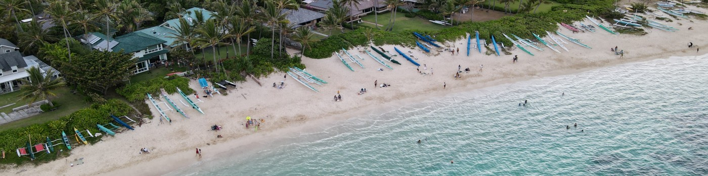

  <b>CV / ML engineer based in NYC, building 0 → 1 systems across <i>healthcare</i>, <i>climate</i>, and <i>robotics</i>.</b>

  <a href="https://www.linkedin.com/in/franklinheng/">LinkedIn</a> ·
  <a href="https://scholar.google.com/citations?user=toxljCEAAAAJ">Google Scholar</a> ·
  <a href="mailto:heng.franklin@gmail.com">heng.franklin@gmail.com</a>

---

## Computer Vision / ML

### Running Tide — computer vision for ocean carbon removal
> *Built the CV stack that verified biomaterial sinking, shellfish growth, and macroalgae biomass at sea.*

<table>
<tr>
<td width="33%" valign="top">

**🌲 Offshore sink-rate tracking**

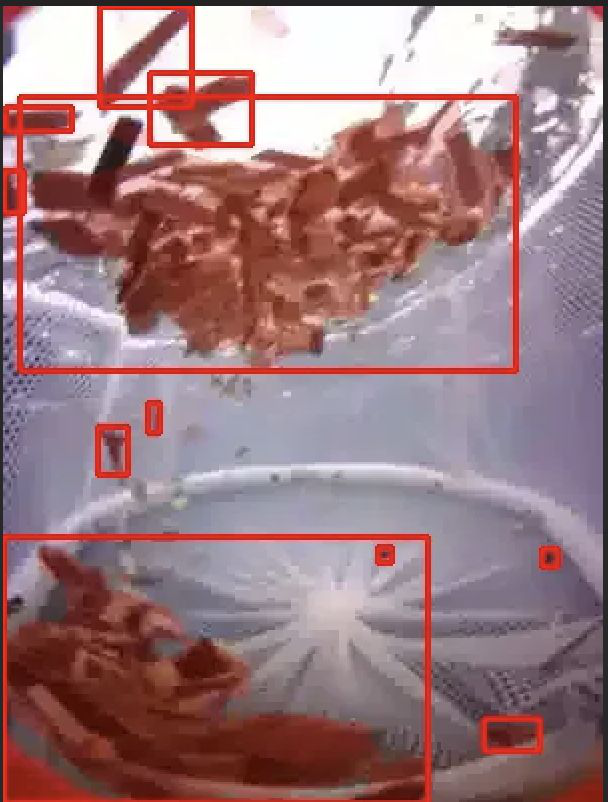

Airflow-triggered pipeline pulls images from custom **ocean-buoy cameras**, uses **Mask-RCNN** to segment wood chips, fits pixel-area to an **exponential decay sink-rate curve** for the carbon-verification dashboard. Dockerized, orchestrated with Cloud Composer.

</td>
<td width="33%" valign="top">

**🌿 Kelp 3D phenotyping**

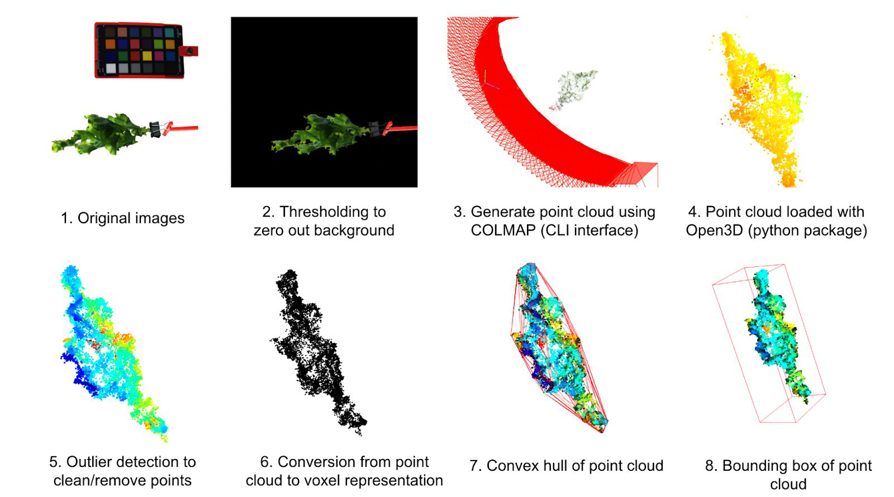

Rotating-blade camera rig → thresholding → **COLMAP** point cloud → **Open3D** outlier removal → voxelization → convex hull volume → biomass regression. Fine-tuned **SAM ViT** to 90% IoU; regression predicts biomass within **1 g**.

📄 [*NAPPN 2022*](https://www.authorea.com/users/510851/articles/588338-nappn-annual-conference-abstract-computer-vision-based-phenotyping-approaches-in-the-brown-macroalgae-saccharina-latissima)

</td>
<td width="33%" valign="top">

**🦪 Robotic shellfish counter**

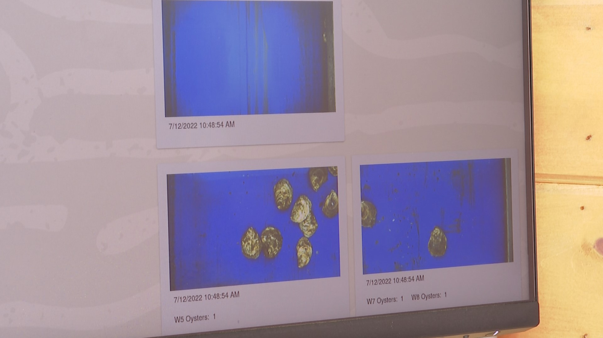

Faster-RCNN fine-tuned to **>90% accuracy at 0.125s/image** on images with ~1,000 shellfish as small as 2×2 px. Custom post-processing to refine boxes for the smallest detections.

</td>
</tr>
</table>

---

### UCSF — clinical computer vision (Fahy / Abbasi / Sohn Labs)

<table>
<tr>
<td width="33%" valign="top">

**🫁 Mucus plug segmentation**

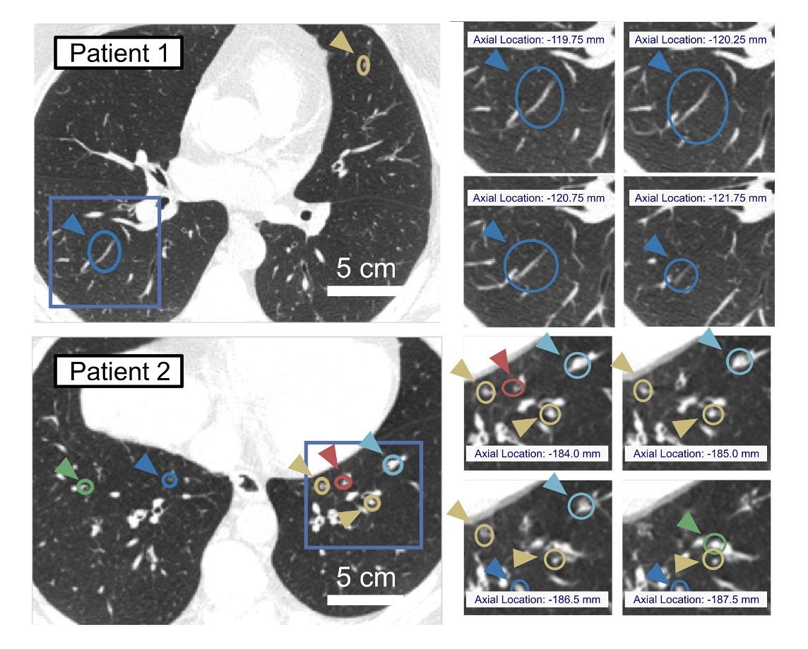

Intensity-threshold lung segmentation → region growing → **GK fuzzy clustering** → **marching cubes** 3D mesh → PCA cylinder fitting. Plugs classified as **stubby (≤12mm) vs. stringy (>12mm)**, deriving a **novel airway-resistance score** correlated with FEV₁ decline across 580+ patients.

📄 [*JCI Insight* (2023)](https://insight.jci.org/articles/view/174124)

</td>
<td width="33%" valign="top">

**🧠 Brain age prediction**

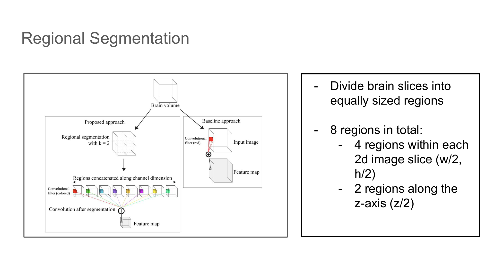

Custom **3D CNN** on head CT with volumetric **regional segmentation** (8 regions per scan). GLM analysis correlating predicted brain age gap against a systemic disease panel.

</td>
<td width="33%" valign="top">

**⚡ EEG engagement decoding**

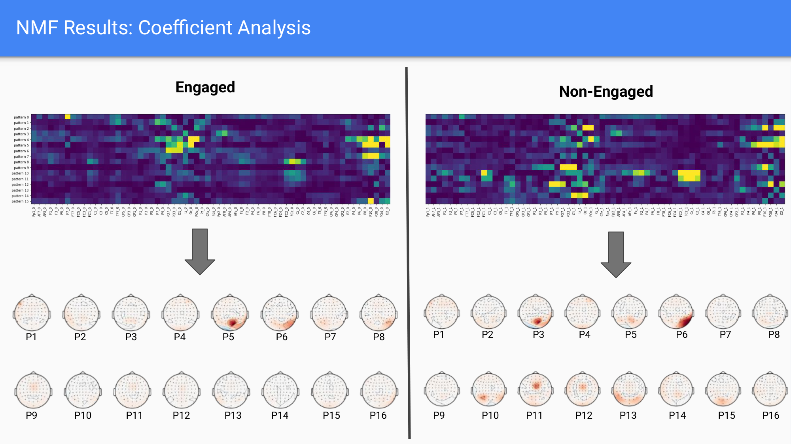

**NMF decomposition** of Morlet wavelet spectrograms from 64-channel EEG. Coefficient analysis reveals distinct **scalp topography patterns** between engaged and non-engaged states.

</td>
</tr>
</table>

---

### Breathily — contactless lung function for ALS patients
> *🥈 2nd place, UC Launch · Funded by UCSF Catalyst · NSF I-Corps · 📜 [US Patent](https://patents.google.com/patent/US20240090795A1/en)*

   
  ▶️ <a href="https://www.youtube.com/watch?v=MaBf3D1GvQA">Watch the demo</a>

Co-founded a startup to make spirometry accessible to patients with ALS and other neuromuscular diseases who **physically can't** form a seal around a traditional spirometer mouthpiece. We replaced the mouthpiece with **Intel RealSense depth cameras** and computer vision — estimating FVC, FEV1, PEF and the full PFT panel from chest wall movement alone.

**Stack:** Intel RealSense · Cubemos skeleton tracking · OpenCV · SciPy · Pixel2Mesh · CNN+LSTM (Keras). IRB-approved patient study at UCSF Pulmonary Function Lab.

📂 [Repo](https://github.com/hengfranklin/Breathily)

---

### UC Berkeley — agricultural robotics CV

  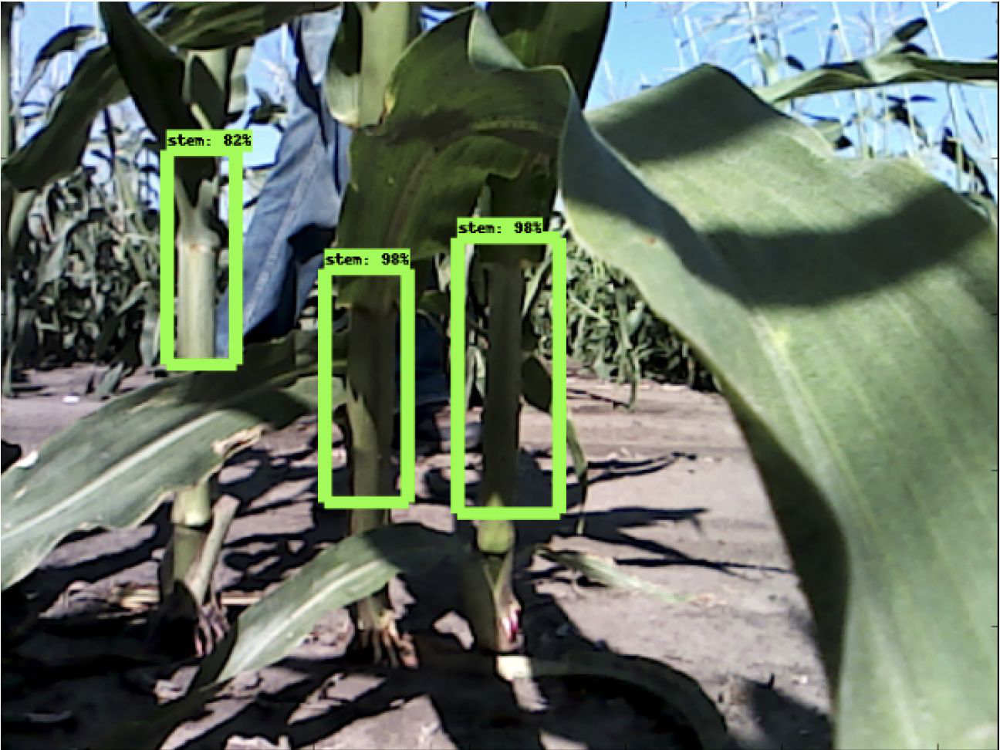

**Sorghum stem width estimation** from a moving robotic platform. Faster-RCNN stem detection → Wiener filter → Canny edges + morphological ops → RANSAC boundary fit → metric width via paired depth image.

📄 *Sahiner, Heng, Balamurugan, Zakhor* — **"In Situ Width Estimation of Biofuel Plant Stems"**, Electronic Imaging 2019

---

## Full Stack AI Engineering

<table>
<tr>
<td width="33%" valign="top">

#### Make The Dot

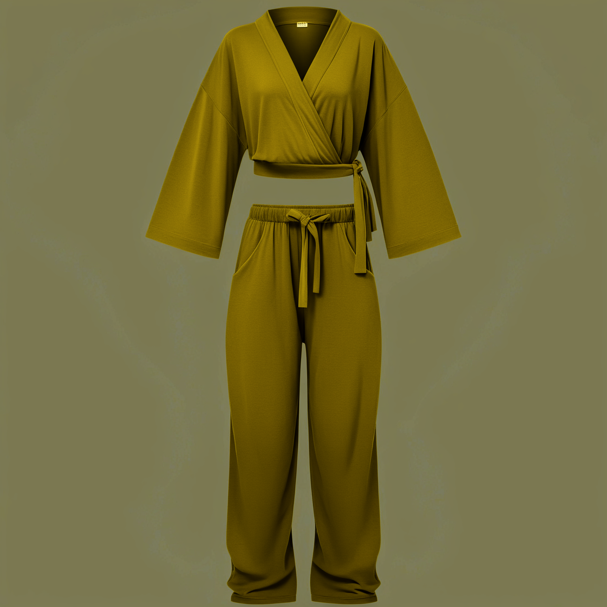

End-to-end **SDXL + ControlNet-Union + custom LoRAs** on **NVIDIA Triton + TensorRT** (H100). Owned the GPU inference stack, LoRA training pipeline, and MLOps glue. Multi-LoRA blending, TensorRT compilation, zero-downtime hot-swap via Hyperdisk ML on GKE.

📂 [Repo](https://github.com/hengfranklin/mtd-portfolio)

</td>
<td width="33%" valign="top">

#### FOIA Fluent

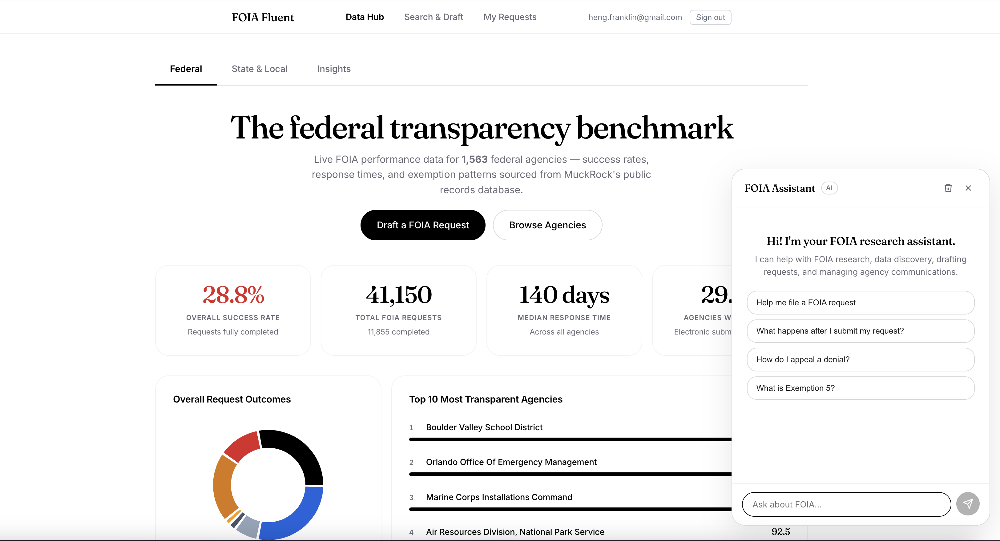

Civic AI that finds public records and drafts legally optimized FOIA / FOIL / CPRA / PIA requests. **Anti-hallucination drafting** — Claude writes only from verified statute text, eCFR regulations, and MuckRock outcomes.

📂 [Repo](https://github.com/dssg-nyc/FOIA-Fluent) · 🔗 [Website](https://www.foiafluent.com)

</td>
<td width="33%" valign="top">

#### GridTech
🥈 *Cross-Columbia GridTech Hackathon 2026*

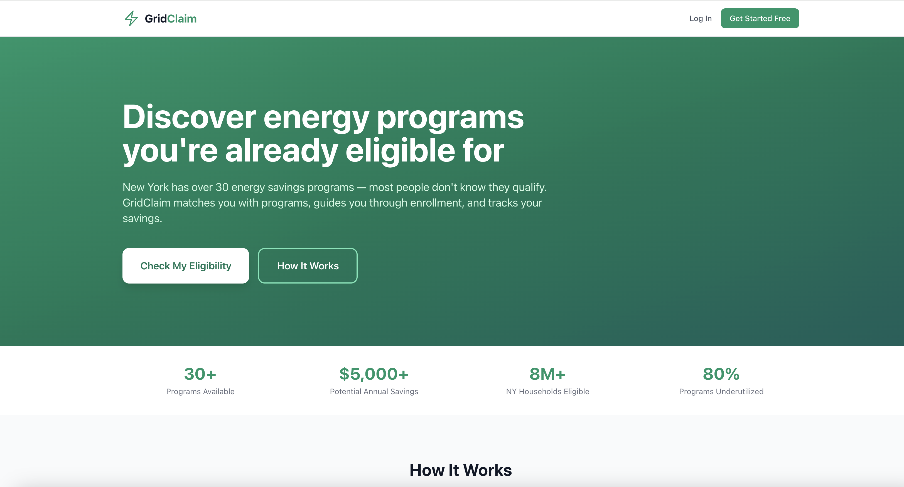

Consolidates fragmented NY energy efficiency programs (Smartcharge NY, SCERP, IRA 30C), surfaces eligibility, and gives utilities a dashboard targeting underutilized programs and grid congestion.

📂 [Repo](https://github.com/hengfranklin/gridtech-hack) · 🔗 [Website](https://gridtech.vercel.app/)

</td>
</tr>
</table>

---

## Earlier work

🛰️ **NASA JPL** — Researched image-processing methods to align and segment multi-wavelength infrared sensor arrays. 📄 [Paper 1](https://www.spiedigitallibrary.org/conference-proceedings-of-spie/9845/984505/Cross-correlation-and-image-alignment-for-multi-band-IR-sensors/10.1117/12.2224694.short) · [Paper 2](https://www.spiedigitallibrary.org/conference-proceedings-of-spie/10203/1/Intelligent-multi-spectral-IR-image-segmentation/10.1117/12.2262730.short)

📱 **Samsung SARC** — Researched mobile object-detection architectures and contributed to a C++ GPU simulator modeling Samsung's mobile GPU.

---

## Selected publications & patents

| Year | |
|---|---|
| 2025 | Lee J., **Heng F.**, Kesarwani M. *"Medication Beliefs regarding P2Y12 inhibitors..."* — **Cureus** *(NLP, Health)* |
| 2023 | Huang B., …, **Heng F.**, …, Fahy J. *"Mucus plugs in proximal airway generations are consequential for airflow limitation in asthma"* — **JCI Insight** *(CV, Health)* |
| 2022 | **Heng F.**, Orain X. *"Methods for Pulmonary Function Testing With Machine Learning..."* — **US Patent**, filed Feb 2022 |
| 2022 | **Heng F.**, Belanger J., et al. *"Computer-vision based phenotyping in Saccharina Latissima"* — **NAPPN** *(CV, Climate)* |
| 2019 | Sahiner A., **Heng F.**, Balamurugan A., Zakhor A. *"In Situ Width Estimation of Biofuel Plant Stems"* — **Electronic Imaging** *(CV, Robotics)* |

[Full list on Google Scholar →](https://scholar.google.com/citations?user=toxljCEAAAAJ)

---

## Toolbelt

| | |
|---|---|
| **CV & ML** | PyTorch · TensorFlow · Keras · Hugging Face Diffusers · OpenCV · Scikit-Image · SAM · ControlNet · LoRA |
| **3D Vision** | COLMAP · Metashape · Open3D · Intel RealSense · Lidar |
| **Serving & MLOps** | NVIDIA Triton · TensorRT · Docker · GKE · Vertex AI · Cloud Run · Cloud Composer / Airflow · Celery |
| **Web** | FastAPI · Next.js · Supabase · Postgres · Redis |
| **Languages** | Python · C++ · MATLAB · TypeScript |

---

## Education

🐻 **B.A. Computer Science**, UC Berkeley

---

## Fun facts

- 🚑 **EMT** — National Registry of EMTs (2024)
- 🤿 **Open Water Scuba Diver** — SSI (2022)

---

## Get in touch

📧 **heng.franklin@gmail.com** &nbsp;·&nbsp; 💼 [LinkedIn](https://www.linkedin.com/in/franklinheng/)